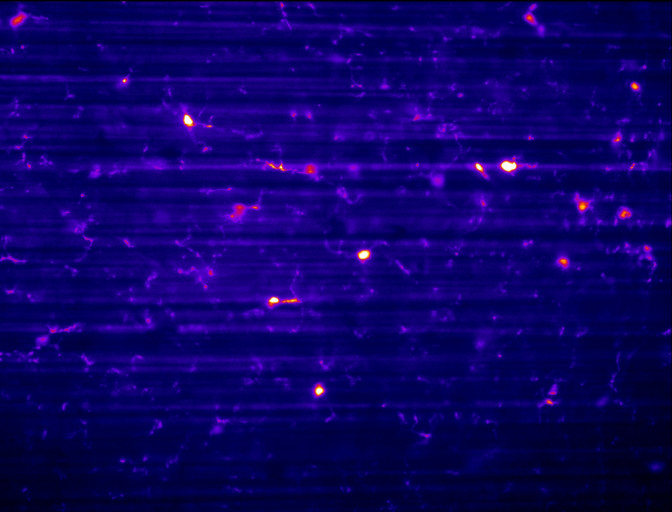
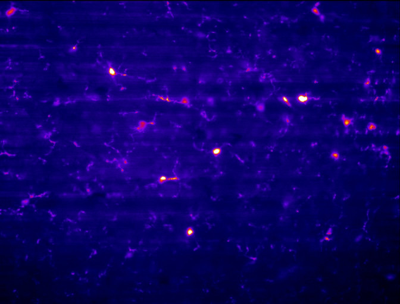
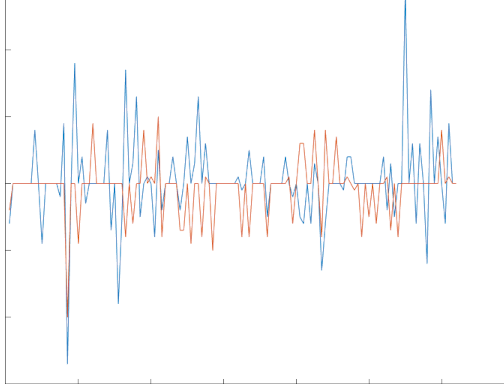

# SPIM-Matlab-Destripe-Deshake
Matlab app to destripe, using Pierre Weiss VSNR, and deshake, using Guizar-Sicairos, Thurman, and Fienup Efficient subpixel image registration algorithms

Data sets from fixed SPIM setups can often contain striping due to dense regions and changes in refractive index, especially in single sided illumination configurations.  This Matlab app uses Variational Stationary Noise Removal (VNSR) from Pierre Weiss, see https://github.com/pierre-weiss, to remove the striping after selecting and previewing the results on different sections of the data stack (see https://github.com/pierre-weiss/VSNR_2D-3D_GPU for Fiji plugin; uses CUDA 8)

The movement of gel samples through the sample in a stepped pattern can induce oscilations, or 'wibble', in the sample between frames, depending on the stage and acquistion parameters.  The 'deshake' option registers the stack using matlab functions from Manuel Guizar-Sicairos, Samuel T. Thurman, and James R. Fienup, "Efficient subpixel image registration algorithms," Opt. Lett. 33, 156-158 (2008).  See html folder in efficient_subpixel_registration folder and https://www.osapublishing.org/ol/abstract.cfm?uri=ol-33-2-156.

## Install
Open Matlab, set working directory to SPIM-Matlab-Destrip-Deshake folder.
Drag and drop `SPIM_ProcessApp_R2017b.mlapp` onto Matlab.
`OR`
Double click `mlapp` file and make sure you open it with the correct Matlab version.

## Compatibility
App testing and working with R2017b.
R2020b version of the app does not work.  Requires `SPIM_reg_desripe.m` to be changed to having `vargin` instead of standard list for `parfor` to work.  Either edit function or change `parfor` to `for` and wait a little longer.

## Usage
Select tif files.  Only tested on single channel zstacks.

Click on images in filename list, and find lowest iterations under Remove Stripes by clicking Test Gabor Function to view results.  The preview and RHS z-slider only shows the middle 30% of the image; quicker preview and assumes that detail normally in the center.

SigmaX and SigmaY are the widths of the Gabor function in X and Y.  This was made for SPIM systems.  Please let me know if you need me to add Theta to change the angle of the Gabor function.

Check Remove Shake and Remove Stripes as needed and click Process Files.  This starts a parallel pool (requires the parallel processing feature on Matlab install; change `parfor` to `for` if not available).

Processing is very very slow.  Find a fast desktop, with many cores, and grab lunch :)
It's a good idea to test the gabor function on a few different images and different regions with varying iterations and sizes to get the best results.  Nice not to have to wait too many times given how slow it is.

## Output
Output tif files will have _ds, _regds, or _reg appended prior to .tif file extension.  Deshaking will come with plot png of x and y translation found, and x and y .mat files of that data will also be saved.

### Examples:
Before and after in cleared neuronal tissue.

Deshake output showing offset in x and y throughout stack (below maxium pixel offset).

